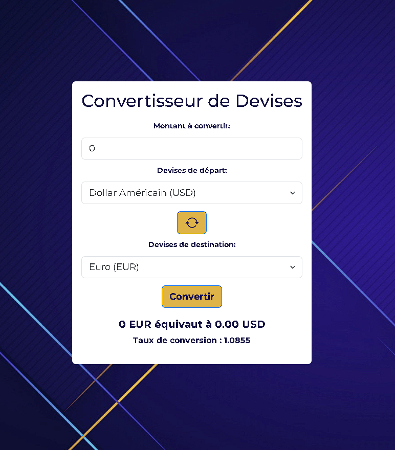

# The-Dream :

## [version WEB]( http://cebe0210-currency-converter.infinityfreeapp.com/?i=1)

## Context :
Ce convertisseur de monnaie FIAT est réalisée dans le cadre d'un exercice **PHP** durant ma formation de Web Developpeur Junior chez [BeCode](https://becode.org/all-trainings/pedagogical-framework-junior-developer/ "site BeCode")

## Consigne :

Vous rêvez de partir en vacances après les cours ? Vous allez quelque part loin, très loin ? Et si nous avions soif d'escalader la montagne de la Table en Afrique du Sud en ce moment, ou de bronzer sur une belle plage hawaïenne et que nous avions désespérément besoin d'un cocktail ? Une chose est sûre : il faudrait calculer combien d'euros coûtera cette boisson bien trop chère 💸

### Caractéristiques

#### 🌱 Les incontournables

Choisissez votre prochaine destination de voyage et vérifiez le taux de change : monnaie locale / Euros.
Créez une petite page Web sur laquelle vous pourrez saisir le tarif local (utilisez un formulaire) et elle vous indiquera le prix en euros. Vous devrez obtenir des tarifs mis à jour à partir d'API externes. Vous pouvez explorer une collection d'API gratuites sur Rapid API , comme celle-ci par exemple.
Utilisez un formulaire qui se soumet à PHP (pas de JS autorisé / pas de PreventDefault)

#### 🌼 C'est bien d'avoir

Permettre à l'utilisateur de choisir entre différentes devises
Fournissez un bouton pour basculer entre les types de valeur (donc Euro -> Dollar devient Dollar -> Euro)

#### Alternatives

Vous pouvez remplacer cet exercice par un convertisseur de crypto monnaie ou un convertisseur d'argent en café (pour savoir de combien de 💸 il faut obtenir une certaine somme de ☕).

## Technologies :

Ce site utilise un fichier index.php, style.css, script.js

- Server local via [MAMP](https://www.mamp.info/ "site-mamp")

- Visuel via fichier CSS et Bootstrap5.3.2 [Bootstrap](https://getbootstrap.com/ "Bootstrap")

- API : [freecurrencyapi](https://api.freecurrencyapi.com)

## Visuel

